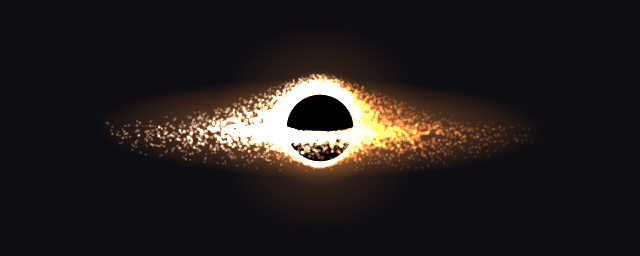
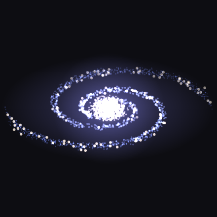
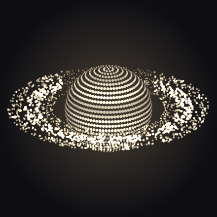
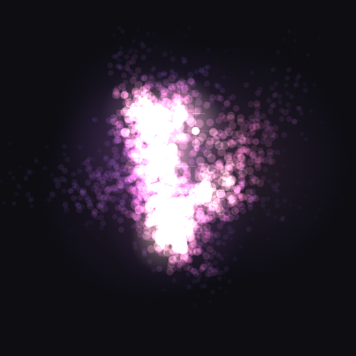
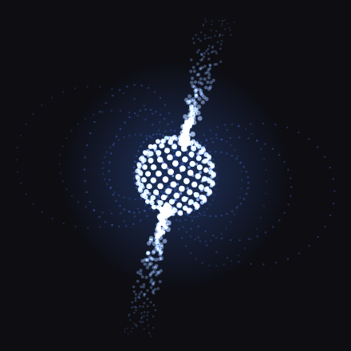
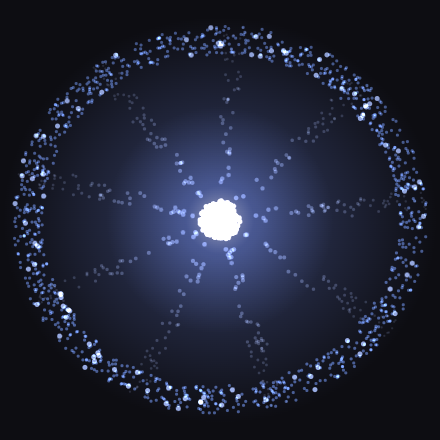
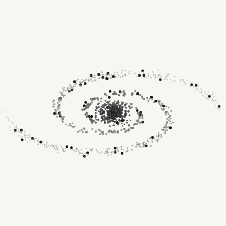

# Ephemeris

Celestial stipple: small animated orbs of things in the sky, drawn as dots on one `<canvas>`. No
dependencies, one script.

<p align="center"></p>
<p align="center">
  
  
  
  
  
  
  
</p>
<p align="center"><sub>Gargantua on a wide canvas, then Andromeda, Saturn, Orion, the Crab pulsar, Earth, the Cartwheel, and Andromeda in ink.
These are stills; every one of them moves. See them live on the <a href="https://tonkatuff.github.io/ephemeris/">demo and playground</a>.</sub></p>

Ten kinds of body, and named presets for forty-two real ones:

| mode | state | what you see |
|---|---|---|
| `blackhole` | pondering | Interstellar's Gargantua: edge-on accretion disk, far side lensed over the top and under the bottom, photon ring, Doppler-bright on the approaching side |
| `pulsar` | pinging | a neutron star as a lighthouse: spinning core, two beams on a tilted magnetic axis, dipole field lines, a flare each time a beam sweeps the camera |
| `galaxy` | swirling | a spiral at a tilt: logarithmic arms, bright flattened bulge, dust scatter, bright knots, the pattern turning slowly |
| `nebula` | dreaming | an emission nebula: overlapping gas clouds as soft drifting dots, stretched into wisps, lit from inside by a few young stars |
| `comet` | rushing | nucleus and coma, a broad curved dust tail and a narrow flickering ion tail streaming away from an off-canvas sun |
| `saturn` | orbiting | a banded globe with three ring bands and the Cassini gap, tilted, rings on Keplerian speeds, planet shadow on the rings |
| `supernova` | erupting | a star collapses, blows a shell outward, the shell fades into a filamentary remnant, the core rebuilds; loops |
| `binary` | pairing | two stars round a barycentre on a tilted orbit, a gas stream pulled off the secondary curling into the primary |
| `eclipse` | aligning | a dotted sun with a corona of streamers; the moon crosses it, corona and prominences show near totality, diamond ring either side |
| `orrery` | revolving | the solar system as a clockwork model: a small Sun, eight planets on compressed orbits at their relative periods, the asteroid belt, Saturn's ring, dotted orbits, seen at a tilt |

### Named bodies

`data-orb-body` picks a mode plus the options and palette that make it that object. Data attributes
still override, and the CSS variables still recolour.

| family | body | mode, notes |
|---|---|---|
| Solar system | `sun` | eclipse, no moon, sunspots, corona |
|  | `mercury` | saturn, cratered, lit from the side |
|  | `venus` | saturn, cream clouds, retrograde |
|  | `earth` | saturn, oceans, land, ice, clouds |
|  | `moon` | saturn, maria, craters, phases |
|  | `earth-moon` | saturn, Earth with the Moon in orbit |
|  | `mars` | saturn, rust, polar caps |
|  | `jupiter` | saturn, no rings, a red spot |
|  | `jupiter-moons` | saturn, Io, Europa, Ganymede, Callisto |
|  | `saturn` | saturn |
|  | `uranus` | saturn, rings on edge |
|  | `neptune` | saturn, dark spot, cloud streaks |
|  | `pluto` | saturn, tan and maroon, the heart |
|  | `solar-system` | orrery |
|  | `totality` | eclipse |
| Comets | `halley` | comet |
|  | `hale-bopp` | comet |
|  | `neowise` | comet |
| Stars | `sirius` | binary, A and the white dwarf |
|  | `albireo` | binary, gold and blue |
|  | `crab-pulsar` | pulsar |
|  | `vela` | pulsar |
|  | `sn1987a` | supernova |
|  | `cassiopeia-a` | supernova |
| Black holes | `gargantua` | blackhole, Interstellar |
|  | `m87` | blackhole, the EHT one |
| Nebulae | `orion` | nebula |
|  | `crab-nebula` | nebula |
|  | `pillars` | nebula |
|  | `carina` | nebula |
| Galaxies | `milky-way` | galaxy, four arms |
|  | `andromeda` | galaxy, M31, tilted grand design |
|  | `triangulum` | galaxy, M33, loose flocculent |
|  | `magellanic` | galaxy, LMC, irregular, a bar and a stub arm |
|  | `whirlpool` | galaxy, M51, face-on |
|  | `pinwheel` | galaxy, M101, face-on, knotted |
|  | `southern-pinwheel` | galaxy, M83, three arms off a bar |
|  | `bodes` | galaxy, M81, warm gold core |
|  | `sombrero` | galaxy, M104, edge-on |
|  | `ngc-1300` | galaxy, barred spiral |
|  | `cartwheel` | galaxy, ring and spokes |
|  | `cigar` | galaxy, M82, edge-on with plumes |

`Ephemeris.GROUPS` is the same list as an object, family name to body names, in this order.

**Demo and playground:** https://tonkatuff.github.io/ephemeris/ (click a body, drag the sliders, copy the tag).

## Use

```html
<script src="src/ephemeris.js"></script>

<canvas class="orb" width="64" height="64" data-orb-body="andromeda"></canvas>
<canvas class="orb" width="64" height="64" data-orb-mode="pulsar"></canvas>
```

Every `canvas.orb` on the page is wired up on load. For canvases added later:

```js
Ephemeris.register(someRoot);   // default: document
```

Or from a CDN, pinned to a commit or tag:

```html
<script src="https://cdn.jsdelivr.net/gh/TonkaTuff/ephemeris@v0.8.1/src/ephemeris.js"></script>
```

### Markup

Height is the preset: it sets dot size, particle count and speed. Width lets a mode stretch, so a
`128×64` black hole gets a disk twice as long as a `64×64`.

| attribute | values | does |
|---|---|---|
| `data-orb-body` | `andromeda` `orion` `saturn` … | a named object, see the table above |
| `data-orb-mode` | `blackhole` `pulsar` `galaxy` `nebula` `comet` `saturn` `supernova` `binary` `eclipse` `orrery` | which kind of body |
| `data-orb-state` | `pondering` `pinging` `swirling` `dreaming` `rushing` `orbiting` `erupting` `pairing` `aligning` `revolving` | same thing, as a state name |
| `data-orb-ink` | `1` | monochrome dots that follow the page theme |
| `data-orb-lite` | `1` | half the particles |
| `data-orb-space` | `1` | dark pill ground with stars |
| `data-orb-arms` | number | galaxy arm count (4 Milky Way, 2 grand-design, spoke count on a ring galaxy) |
| `data-orb-spin` | number | pulsar spin (4.2), saturn rotation (0.35), binary orbit (0.9), comet flow (1), orrery and nebula time scale (1) |
| `data-orb-tilt` | number | pulsar magnetic-axis tilt (0.62), saturn ring tilt (0.42) |
| `data-orb-period` | seconds | supernova cycle (6), eclipse crossing (10), moon phase cycle (24) |
| `data-orb-surface` | `bands` `moon` `mercury` `earth` `mars` `pluto` | planet surface on the saturn mode |
| `data-orb-phase` | 0..1 or `cycle` | sun angle: 0 full, 0.5 new; `cycle` waxes and wanes over `period` |
| `data-orb-clouds` | number | nebula cloud count (default 5) |
| `data-orb-stars` | number | nebula star count (default scales with size, 3 at 64) |

Flags stack: `data-orb-lite=1 data-orb-space=1` on a `320×160` is fine.

### Colour

Six CSS custom properties on the canvas or any ancestor. They are read every frame, so a theme switch
or a `:hover` rule applies live. Each mode has its own defaults; set one variable and the rest keep
the mode's default. Ink ignores them.

```css
canvas.orb {
  --orb-cold:   #1E56D8;   /* far / receding / outer    */
  --orb-mid:    #7FB0FF;   /* mid                       */
  --orb-hot:    #EAF3FF;   /* near / approaching / core */
  --orb-glow:   #3D7BFF;   /* halo + haze               */
  --orb-ring:   #F2F8FF;   /* photon ring (blackhole)   */
  --orb-shadow: #000000;   /* the hole (blackhole)      */
}
```

Defaults per mode: blackhole is ember (`#FF781E` → `#FFB782` → `#FFF6E6`, glow `#FFA546`), pulsar is
cobalt (above), galaxy is milky way (`#4D6BFF` → `#C9B8FF` → `#FFF3D6`, glow `#8A7CFF`), nebula is
orion (`#4B3FBF` → `#D05AA0` → `#FFD9C2`, glow `#8A4FD0`).

### JavaScript

Every mode is a plain function, `(ctx, size, t, dark, opts)`, so you can drive it from your own loop.
The signature matches thinking-orbs, so it drops into that engine too.

```js
Ephemeris.draw('galaxy', ctx, 64, t, dark, {
  arms: 2, lite: true, w: 128,
  palette: { cold: [10,122,90], mid: [95,216,176], hot: [232,255,246],
             glow: [32,180,138], ring: [255,255,255], shadow: [0,0,0] }
});

// into an engine with the same signature
Orbs.MODE_DRAWS.pulsar = Ephemeris.MODES.pulsar.draw;
Orbs.STATE_TO_MODE.pinging = 'pulsar';
```

`opts`: `w` canvas width (default = size), `ink`, `lite`, `space`, `palette`, plus per-mode knobs
(`arms`, `wind`, `pitchAngle`, `omega`, `bar`, `ring`, `spokes`, `scatter`, `knots`, `plume` for galaxy; `clouds`, `starN` for nebula; `spin`, `tilt` for
pulsar and saturn, `rings`, `spot` (true or `dark`), `streaks`, `bandAmp`, `surface`, `phase`, `moons` for saturn; `moon`, `spots`, `radius` for eclipse; `period` for supernova and eclipse; `reach`, `omega`
for blackhole). Named bodies: `Ephemeris.body('andromeda', ctx, 64, t, dark, { lite: true })`.

### Behaviour

- Paused when scrolled off-screen and on hidden tabs, so a page full of them costs nothing idle.
- Device pixel ratio capped at 2.
- `prefers-reduced-motion` draws one still frame, repainted on theme change.
- Dot radius follows the engine's `(size/300)^0.6`; particle counts follow size.

## Want another object?

Open an issue with a photo. A named body is a dozen lines: a mode, a few options and six colours.

## Name

An ephemeris is the table that tells you where every body in the sky is at a given time.

## Licence

MIT
